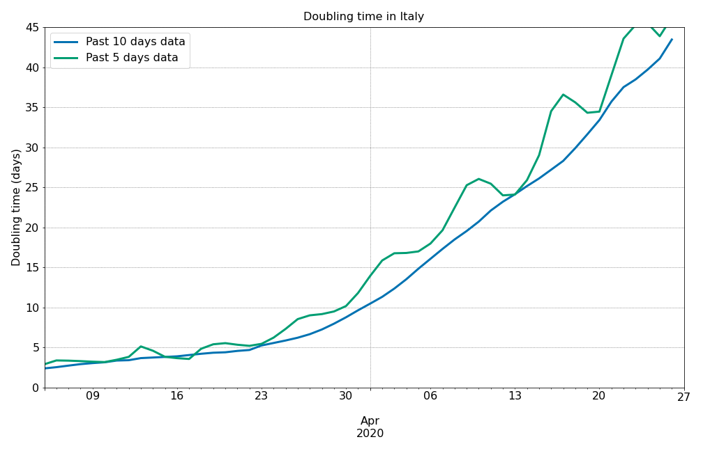
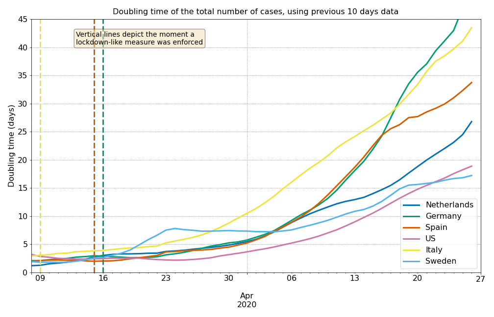
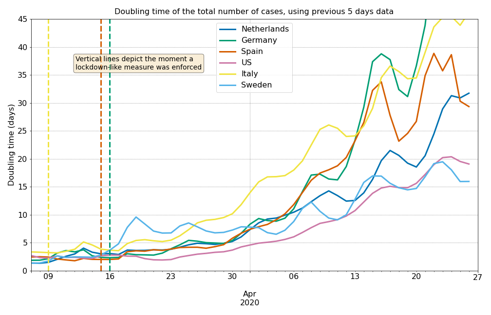
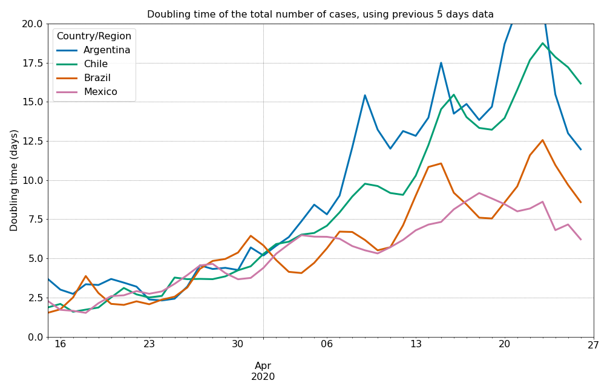

# Doubling Time
One of the easiest parameters to understand the progression of the pandemic is looking at the time it takes to double the total number of cases. If the growth would be exponential, the doubling time would be constant, regardles of which sub-set of points one decides to look at. My idea is, therefore, to look at groups of consecutive days, fit the exponential and extract the gowth rate, move to the following date and repeat. In this way I can extract the doubling time as a function of time. 

The main issue with this analysis is that data is noisy, and therefore fitting only 3 data points would lead to spurious results. If, however, the window is too large, we won't be able to see changes. This is how the code looks like for a 10-day window:

```python
window_length = 10
doubling_time = {}
for country in list(new_cases):
    doubling_time[country] = np.zeros(len(sick_data)-window_length)
    for i in range(len(new_cases)-window_length):
        x = np.arange(0, window_length)
        y = sick_data[country][i:i+window_length].array
        y = np.log2(y)
        p = np.polyfit(x, y, 1)
        doubling_time[country][i] = 1/p[0]
```

I decided to fit directly the logarithmic in base two of the data in order to extract directly the inverse of the doubling time. The real code in the notebook, takes care of some edge cases, for example when number of cases does not increase over some days (which happens at the very beginning and in some cases at the newest data points). 

We can look at the data from Italy, for example in order to understand the impact that the length of the window has on the analysis:



Using the 5-day window it is possible to see some oscilation in the doubling time. Surprisingly, this oscilation has a periodicity of 7-days. If I were to risk a hypothesis, I would say the number of new cases reported changes on weekends, perhaps fewer tests are run and reported. The 10-day window is more smooth, but it will have a longer reaction time to detect changes. Notice that it is almost always lower than the number reported by the 5-day window. 

Which time-window to use depends on the analysis that needs to be done. For overall trends, I would choose the 10-day, while for an ongoing pandemic, in which decisions are made on a weekly basis, perhaps the 5-day window shows more insight. 

## 5 and 10 day window for Europe and US

Just to have an example beyond only Italy, we can compare the differences using a 5-day or a 10-day window for some countries in Europe and the US:





Again, the 7-day periodicity appears for some countries. Overall, the trend is always increasing, which means the spread of the pandemic is slowing down. 

Something that really grabs my attention is the the doubling time in Germany and Spain is virtually the same. However, the lockdown measures each country has taken are very different. That makes me wonder about the role of the lockdown and the role of social idiosyncrasies in different countries. It is very easy to draw superficial conclusions out of these data, but it is always a point to take into account. 

## Doubling Time in Latin American Countries



The doubling time in some Latin American countries is showing a very different behavior according to the case studied. Argentina's doubling time is increasing steadily, while Brazil's and Mexico's is virtually stable. The doubling time in Brazil and Mexico is, today, what was in Germany or Spain one month ago. Chile is in between those cases. 

The reasons behind each one of those curves is directly related to the policies each country adopted. 