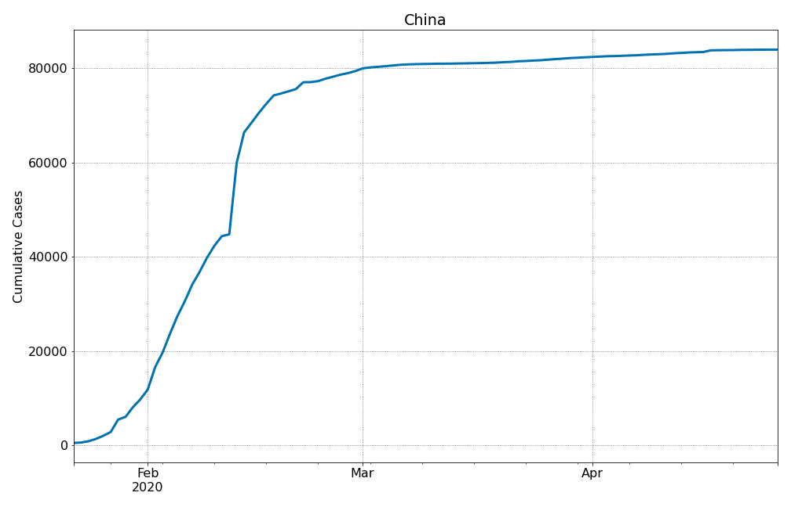
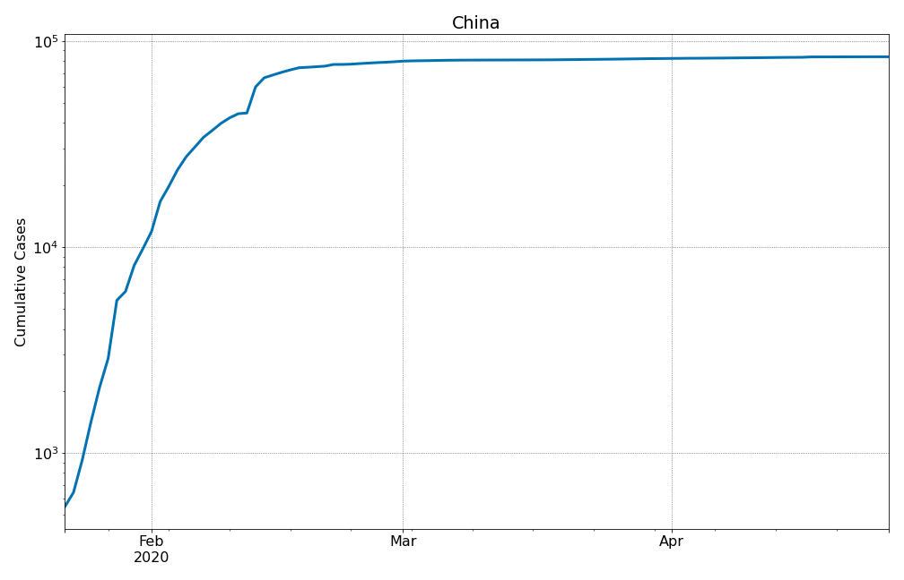
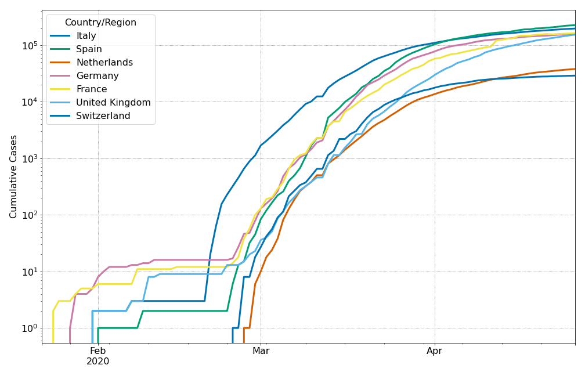
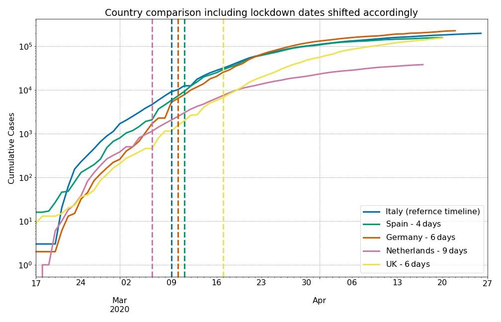
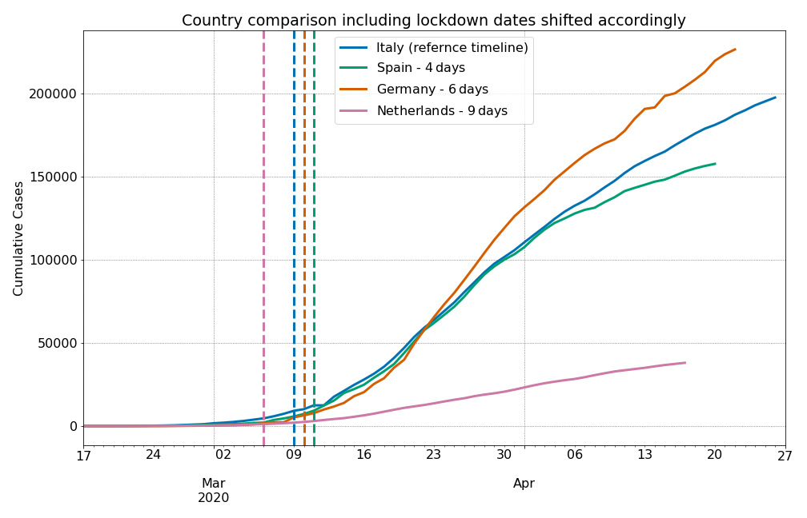
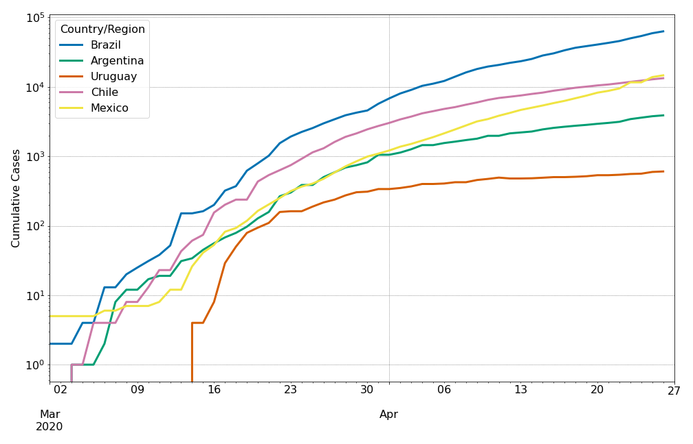
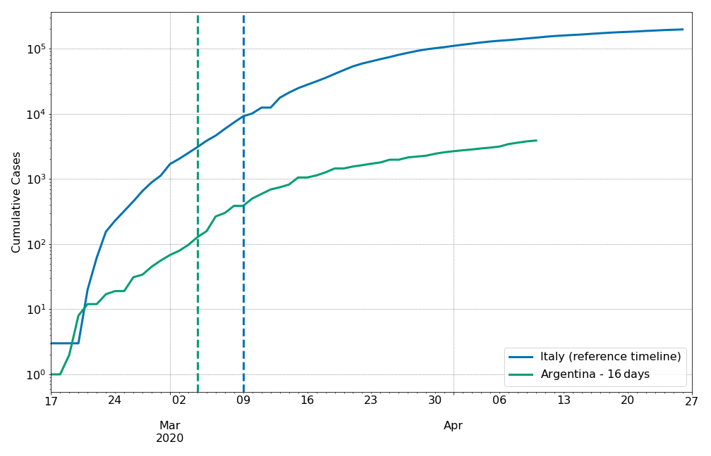
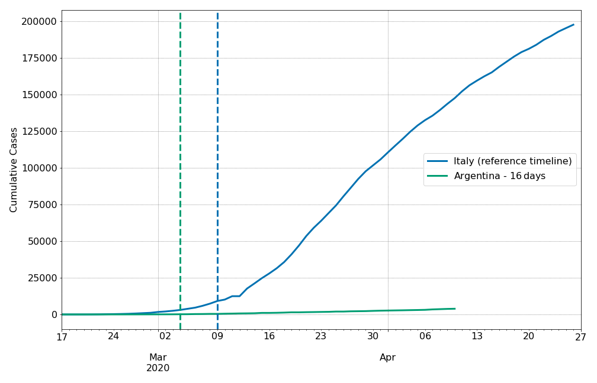

# Covid-19-Jupyter-Notebook
Example Jupyter notebook to explore the data of the ongoing COVID-19 Pandemic.

Data is pulled from [this repository](https://github.com/CSSEGISandData/COVID-19) which is updated regularly by the [Whiting School of Engineering of the Johns Hopkins University](https://systems.jhu.edu/research/public-health/ncov/).

To get started, head to [this notebook](https://github.com/aquilesC/Covid-19-Jupyter-Notebook/blob/master/Covid_Time_Series.ipynb)

## Figures
The notebook explores different countries and compares them, also shifting the dates to visualize the differences between countries. These are some of the Figures generated by the notebook:

### China over time

This is the evolution of the number of active cases in China over time. This number is the total number of confirmed cases excluding recoveries and deaths. I believe this plot is much more illustrative of the situation than just the cumulative sum of detected cases. 

Since the evolution of the number of cases spans several orders of magnitude, it may be better to plot the information in logarithmic scale:

### Europe over time
Europe as a whole is being very badly hit by the spread of nCOV19. Below you can see the evolution of the number of active cases in different countries. 

It is possible to see that the onset of the epidemic in each country happens at different times. Instead of relying on the first detected case, I shift the temporal information of the countries by the moment in which 10 cases were detected and use *Italy* as a reference. The fact I use 10 cases instead of the first is that there are a lot of statistical fluctuations when the number of cases is low. For example, one detected case may be contained and eventually recover, until a second case appears. From the plots above, it seems that once there are 10 cases detected in a country, there is no going back in the evolution of the spread. 

To give a bit more context, we can also add the dates of lockdowns or cease of activities, using the same temporal scale than in the previous plot. Some countries such as Italy went into full lockdown, while some countries, such as The Netherlands are in a state where some activities are forbidden (bars, restaurants), schools are closed, but people are not banned from going out even without reason. 

And of course, we can show the same data but in a linear scale, since log-scale may be slightly counter-intuitive for people who are just getting acquainted with exponential processes:

### Latin America
Another interesting region to observe is Latin America. Each country is showing very different evolutions over time. 

And as an example, we can see the difference between **Italy** and **Argentina**, two countries that have established complete lockdowns to prevent the spread:

The same plot but in linear scale is very eloquent:

## Contribute
There are different ways of contributing to the code. If you identify a problem, you can create an [Issue](https://github.com/aquilesC/Covid-19-Jupyter-Notebook/issues) explaining what you found. If you know the solution or would like to improve any of its parts, I encourage you to create a fork of this repository, implement it and then submit a pull request. In this way, the authorship of the code will be nicely documented. 

### Useful information to gather
- Information on lockdowns or closure of activities
    I could gather some information about lockdowns or massive closure of activities in a handful of countries. This information could be systematized
    
- Number of hospitalizations
    I don't know of a source to include the number of people who are hospitalized. This is crucial to understand the evolution of the disease, not just the spread of the virus.
    
- Number of beds in hospitals
    A useful parameter to show in the figures is the total number of beds in hospitals for the countries. Especially with the number of hospitalizations, it may give insight into when countries are locking down and how much room for further expansion of the epidemic is available, globally and locally.

## LICENSE
The code is released under an MIT License. This means you can reuse it and redistribute it as you see fit. The data is released with stringent terms and conditions, and thus you should be careful with the usage you make out of it. I consider this repository an example of educational usage of the data. 